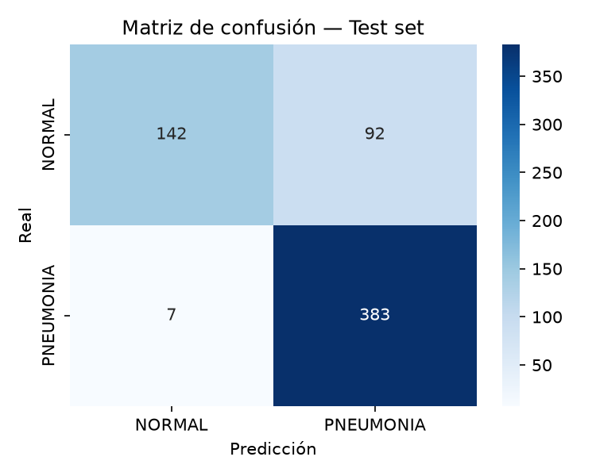
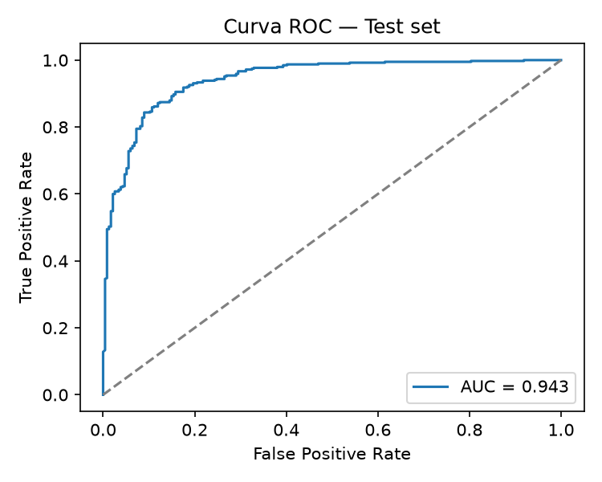
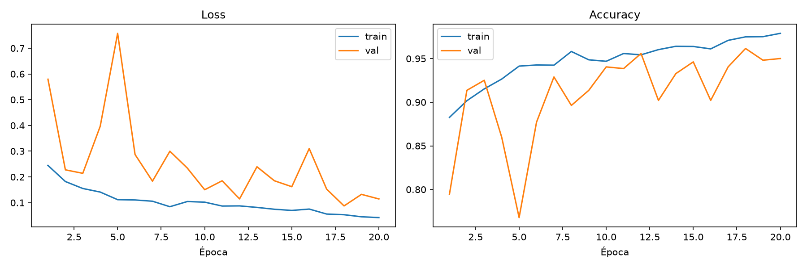

# Reporte de Evaluación Formal

## 1. Resumen del experimento

- **Modelo:** CNN estilo VGG, bloques dobles Conv + BatchNorm + GlobalAveragePooling
- **Dataset:** Chest X-Ray Images (Pneumonia) — NORMAL vs PNEUMONIA
- **Tamaño de imagen:** 224×224
- **Splits:** Train / Val (redistribuido) / Test
- **Notebook fuente:** `training/baseline.ipynb`

- **Epochs:** 20
- **Batch size:** 32
- **Learning rate:** 1e-3 (inicial), reducido a la mitad con ReduceLROnPlateau (patience=3)
- **Optimizador:** Adam
- **Función de pérdida:** CrossEntropyLoss con class weights
- **Balanceo de clases:** WeightedRandomSampler en entrenamiento + class weights en la pérdida
- **Augmentation (train):** RandomHorizontalFlip + RandomRotation(±10°)
- **Dropout:** 0.4

## 2. Métricas globales

| Métrica   | Valor |
|-----------|-------|
| Accuracy  | 0.84 |
| Precision (promedio) | 0.88 |
| Recall (promedio)    | 0.79 |
| F1-score (promedio)  | 0.81 |
| ROC-AUC   | 0.9427 |

## 3. Métricas por clase

| Clase     | Precision | Recall | F1-score | Soporte |
|-----------|-----------|--------|----------|---------|
| NORMAL    | 0.95 | 0.61 | 0.74 | 234 |
| PNEUMONIA | 0.81 | 0.98 | 0.89 | 390 |

## 4. Matriz de confusión

La matriz de confusión revela 7 falsos negativos (casos de PNEUMONIA clasificados como NORMAL) y 92 falsos positivos (casos de NORMAL clasificados como PNEUMONIA).  
Los falsos negativos representan el error más crítico desde el punto de vista clínico: un paciente con neumonía real no recibiría el tratamiento necesario, permitiendo que la infección avance sin intervención médica. Afortunadamente, el modelo los minimiza notablemente.  
Los falsos positivos, aunque más frecuentes, son clínicamente más manejables: el paciente sería remitido a pruebas adicionales que eventualmente confirmarían su estado de salud. El costo es una carga innecesaria al sistema médico, pero no un riesgo directo para el paciente.  
En conjunto, el modelo prioriza implícitamente la sensibilidad sobre la especificidad, un comportamiento deseable en contextos de diagnóstico médico donde los falsos negativos tienen consecuencias más graves.

## 5. Curva ROC

El modelo obtuvo un ROC-AUC de 0.9427 sobre el conjunto de test. Esta métrica representa la probabilidad de que, al elegir aleatoriamente un caso PNEUMONIA y un caso NORMAL, el modelo asigne un score de riesgo más alto al caso PNEUMONIA, evaluando la capacidad de discriminación del modelo de forma independiente al umbral de decisión utilizado para convertir probabilidades en clases. En una escala de referencia donde 0.5 equivale a una clasificación puramente aleatoria y valores por encima de 0.9 se consideran excelentes, el valor obtenido indica que el modelo aprendió una representación interna capaz de separar con alta consistencia las distribuciones de probabilidad de ambas clases.

Este resultado contrasta con las métricas obtenidas bajo el umbral de decisión por defecto (0.5), donde el recall de la clase NORMAL fue de solo 0.61 frente a un 0.98 en PNEUMONIA. La brecha entre un AUC alto y un recall bajo en la clase minoritaria sugiere que el modelo separa bien las clases en términos de score continuo, pero que el umbral de 0.5 no está calibrado de forma óptima para este problema, probablemente como efecto del esquema de class weights aplicado en la función de pérdida, que favorece la sensibilidad hacia PNEUMONIA. Esto abre la posibilidad de ajustar el punto de operación del clasificador (por ejemplo, desplazando el umbral a un valor entre 0.6 y 0.7) utilizando los pares (FPR, TPR) de la curva ROC, en lugar de modificar la arquitectura o el entrenamiento, para mejorar el balance entre precisión y recall en la clase NORMAL sin sacrificar la sensibilidad hacia los casos de neumonía.

## 6. Curvas de entrenamiento (loss / accuracy)

El train loss desciende de forma casi monotónica a lo largo de las 20 épocas (de 0.2446 a 0.0420), mientras que el val loss muestra un comportamiento mucho más ruidoso, con caídas seguidas de picos pronunciados en las épocas 4-5, 8, 13 y 16, antes de estabilizarse parcialmente hacia el final del entrenamiento. Esta brecha entre ambas curvas (0.0420 vs 0.1144 en loss final, y 0.979 vs 0.950 en accuracy) es consistente con un overfitting leve: el modelo continúa ajustándose a los datos de entrenamiento mientras la mejora en validación se estanca. Sin embargo, no se observa un overfitting severo o divergente, ya que el val loss no muestra una tendencia sostenida al alza hacia el final; el ruido observado es más atribuible al tamaño reducido del conjunto de validación (521 imágenes), donde unos pocos batches difíciles pueden desplazar la métrica de forma notable de una época a otra.

En cuanto a la convergencia, el mejor val_loss (0.0873) se alcanzó en la época 18, dos épocas antes de finalizar el entrenamiento, y las épocas 19 y 20 no lograron mejorar ese resultado. Esto indica que el modelo ya había alcanzado su mejor punto de generalización antes de agotar las 20 épocas programadas, y que extender el entrenamiento más allá de ese punto no aportó beneficio adicional. El scheduler ReduceLROnPlateau (patience=3) probablemente contribuyó a moderar las oscilaciones del val loss en las últimas épocas al reducir la tasa de aprendizaje, aunque algunos picos aislados persisten incluso después de su intervención.

## 7. Análisis crítico

**¿El desempeño es aceptable para el caso de uso (diagnóstico asistido)?**  
Como herramienta de apoyo (no de diagnóstico autónomo), el desempeño es prometedor pero no suficiente todavía. El ROC-AUC de 0.9427 muestra que el modelo discrimina bien entre clases en términos de score continuo, y el recall de 0.98 en PNEUMONIA es clínicamente deseable porque minimiza falsos negativos (el error más costoso en este contexto). Sin embargo, el recall de solo 0.61 en NORMAL implica que casi 4 de cada 10 radiografías sanas se marcan como sospechosas de neumonía. En un sistema de apoyo esto es tolerable si el flujo clínico contempla una revisión humana de los casos positivos, pero generaría una carga significativa de falsos positivos (92 casos) que saturaría ese proceso de revisión. Para uso real se necesitaría recalibrar el umbral de decisión antes de considerar el modelo aceptable.

**¿Qué limitaciones tiene el experimento?**

- *Tamaño del val set:* 521 imágenes es una muestra pequeña, lo que explica el comportamiento ruidoso del val loss (picos en épocas 4-5, 8, 13, 16) y reduce la confiabilidad de las métricas por época usadas para early stopping/scheduler.
- *Desbalance de clases:* 390 PNEUMONIA vs 234 NORMAL en test. Aunque se mitigó con WeightedRandomSampler y class weights, el efecto persiste visible en el recall asimétrico — el modelo sigue sesgado hacia predecir PNEUMONIA.
- *Overfitting leve:* la brecha entre train loss (0.0420) y val loss final (0.1144), y entre train accuracy (0.979) y val accuracy (0.950), indica que el modelo memoriza parte del set de entrenamiento, aunque sin divergencia severa.

**¿Qué cambiarías para la siguiente iteración?**

- Recalibrar el umbral de decisión usando los pares (FPR, TPR) de la curva ROC en vez de usar 0.5 por defecto, para subir el recall de NORMAL sin sacrificar el de PNEUMONIA.
- Evaluar augmentation adicional (CLAHE, ajustes de contraste) específico para radiografías, dado que flip horizontal y rotación ±10° son augmentations genéricas que no explotan el dominio médico.

## 8. Conclusión

El baseline cumple su función como punto de partida: confirma que una CNN entrenada desde cero puede aprender una representación útil de este dataset. No es un modelo listo para producción, pero sí una base experimental sólida y bien diagnosticada.
